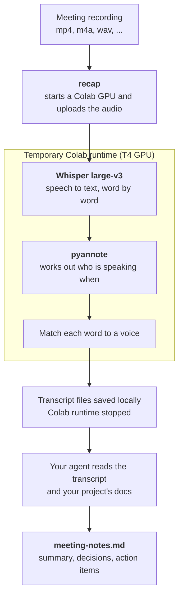

<div align="center">

# TLDR Recap

**From a meeting recording to a transcript and notes you can actually skim.**

TLDR Recap turns recorded meetings into timestamped, speaker-labeled transcripts on a temporary [Google Colab](https://colab.research.google.com/) GPU. Your agent then reads the transcript and writes concise English notes. Meetings can be in any language Whisper supports.

[](https://www.python.org/)
[](#use)
[](https://colab.research.google.com/)

</div>

## At a glance

Ask your agent for a recap (Claude Code shown, Codex uses `$tldr-recap`):

```text
/tldr-recap ~/recordings/research-sync.mp4 keep it short, decisions and owners first
```

Or run the command yourself:

```bash
recap ~/recordings/research-sync.mp4
```

It reports progress as it goes (abridged):

```text
Allocating a T4 Colab runtime...
Uploading 1 recording(s)...
Transcribing with Whisper large-v3...
Identifying speakers...
Downloading speaker-labeled artifacts...
Stopping the temporary Colab runtime...
Artifacts saved to: /Users/you/meetings/2026-09-20_18-30-research-sync
```

Everything lands in a timestamped folder under `./meetings/`, or wherever you point `--output-dir`:

| File | What it holds |
|---|---|
| `transcript.md` | The whole conversation, timestamped and split by speaker |
| `transcript.json` | The same transcript with word-level timings |
| `metadata.json` | Duration, detected language, model and device |
| `meeting-notes.md` | Concise English notes, written by your agent |

The `recap` command produces the first three files. The notes come from your agent. This is what `transcript.md` looks like:

```text
[00:00:04] Dr. Alice Turner
Let's focus today on the retrieval results and whether the evaluation actually supports the domain-shift claim. Can you summarize the current experiment?

[00:00:16] James Miller
I built a corpus from approximately twelve thousand cybersecurity advisories published between 2018 and 2025. ...
```

## Install

You need:

- macOS or Linux
- [`uv`](https://docs.astral.sh/uv/)
- A Google account that can start a Colab GPU runtime
- A Hugging Face account, for speaker labels
- Claude Code or Codex, for the notes (the `recap` command runs without one)

**1. Install the Google Colab CLI and authorize it once.**

```bash
uv tool install --with 'jupyter-kernel-client==0.9.0' 'google-colab-cli==0.6.0'
colab sessions
```

Use the pinned versions: a plain install brings in a `jupyter-kernel-client` that `colab` cannot use. Run `colab sessions` in an interactive terminal and complete Google's one-time authorization before your first recap.

**2. Set up Hugging Face for speaker labels.**

Accept the conditions on [`pyannote/speaker-diarization-community-1`](https://huggingface.co/pyannote/speaker-diarization-community-1), then log in:

```bash
uvx --from huggingface_hub hf auth login
```

The `HF_TOKEN` environment variable works too. If you always pass `--no-diarization`, skip this step.

**3. Install the `recap` command and link the skill.** From this checkout:

```bash
uv run --no-project scripts/install.py
```

This installs `recap` as an editable `uv` tool and links the skill into `~/.claude/skills/tldr-recap` (Claude Code) and `~/.agents/skills/tldr-recap` (Codex). A harness is only linked if its directory (`~/.claude`, `~/.agents`) already exists; otherwise the installer skips it and says so. The links point at this folder instead of copying it, so keep the checkout in place. If you move it, run the installer again from the new location.

Check that it worked:

```bash
recap --help
```

## How it works



Colab does the heavy lifting: Whisper turns speech into text with word-level timing, and pyannote decides who was speaking. Everything after that happens on your machine. Your agent reads the transcript, checks your project's docs for context when that helps, and writes the notes. The temporary Colab runtime is stopped when the job ends.

## Naming the speakers

Speaker detection separates the voices but cannot name them, so the transcript starts with generic labels such as `SPEAKER_00` and `SPEAKER_01`. When names matter, your agent shows you a line or two from each voice and asks who it is. Answer in plain language, and it swaps the labels for names in `transcript.md` and `transcript.json`:

```bash
recap speakers meetings/2026-09-20_18-30-research-sync \
  SPEAKER_00="Dr. Alice Turner" SPEAKER_01="James Miller"
```

Several labels can map to the same person, and you can leave any label anonymous.

## Example notes

Trimmed from the [bundled example](skill/tldr-recap/references/examples/2026-09-20-retrieval-domain-shift/), which also includes its full transcript.

```markdown
# Retrieval under temporal domain shift

- **Project:** Thesis on retrieval-augmented question answering over cybersecurity advisories
- **Participants:** Dr. Alice Turner (advisor), James Miller (student)

## Summary

Dr. Alice Turner and James Miller reviewed an experiment comparing lexical, dense, and hybrid retrieval over cybersecurity advisories. They identified leakage in the current chunk-level dataset split and agreed to rebuild the evaluation around a strict temporal boundary before drawing conclusions from the reported retrieval gains.

## Decisions

- Group documents by CVE identifier before splitting the dataset.
- Use documents published through the end of 2024 for training and validation.
- Reserve 2025 advisories exclusively for the temporal test set.
- Use paired bootstrap confidence intervals with 10,000 samples instead of a paired t-test.

## Action items

- **James**
  - Rebuild the dataset using advisory-level grouping and a strict 2024/2025 temporal boundary.
  - Rerun BM25, E5-base, and hybrid retrieval using exact search.
  - Deliver the corrected manifest, retrieval table, and failure analysis by Friday afternoon.

- **Dr. Alice Turner**
  - Prepare a blinded claim-level annotation sheet.

## Open questions

- Whether BM25 hard negatives improve dense-retriever fine-tuning.
- Whether a weighted hybrid outperforms fixed reciprocal rank fusion.
```

Full notes also carry an "Important discussion" section with one subsection per topic, and "Follow-ups" for items that were explicitly deferred.

## Use

### With an agent

```text
/tldr-recap ~/recordings/research-sync.mp4
/tldr-recap ~/recordings/design-review.m4a list who owns what
/tldr-recap part-1.mp4 part-2.mp4 focus on what changed since last week
```

Anything you write after the file paths steers what the notes emphasize. Several paths are treated as consecutive parts of one meeting. If you leave out the recording or the output location, the agent asks for it.

### With the command alone

```bash
recap /path/to/meeting.mp4
recap part-1.mp4 part-2.mp4 --language fr
recap meeting.mp4 --output-dir /path/to/meeting-summary
recap meeting.mp4 --no-diarization
recap speakers /path/to/meeting-summary SPEAKER_00=Alice SPEAKER_01=Bob
```

| Option | Default | Meaning |
|---|---|---|
| `--language` | auto-detect | Whisper language code such as `en` or `fr`. |
| `--model` | `large-v3` | Whisper model. |
| `--gpu` | `T4` | Colab GPU type. |
| `--output-dir` | `./meetings/<timestamp>-<name>` | Where the files are written. Must not exist yet. |
| `--no-diarization` | off | Skip speaker labels. No Hugging Face token is uploaded. |
| `--num-speakers` | inferred | Known number of speakers. |

### Several recordings

Speakers are identified separately in each recording, so labels are numbered per part (`PART1_SPEAKER_00`, `PART2_SPEAKER_00`) and the same person usually has a different label in each part. Map them to one name:

```bash
recap speakers <output-dir> PART1_SPEAKER_00=Alice PART2_SPEAKER_01=Alice
```

## Privacy

Recordings are uploaded to a temporary Google Colab runtime that is stopped when the job ends. When speaker labels are enabled, your Hugging Face token is uploaded to the same runtime and deleted once the model loads. With `--no-diarization` no token is uploaded. Transcripts and notes are written to your local disk. Get consent from everyone on a recording before you use it, and check that uploading its content to Colab is acceptable.

## Limitations

- You need a Colab GPU. Whether one is free depends on your Colab quota.
- Speaker labels are best effort. Two people can end up under one label, or one person under two, especially when voices overlap. Skim the notes before you rely on them.
- Transcripts stay in the language that was spoken. Only the notes are in English.
- Speakers are labeled per recording, with no voice matching across recordings.
- Recorded audio and video only. Live meetings are not captured.

## Development

```bash
uv run python -m unittest discover -s tests
```

```text
src/tldr_recap/     CLI, Colab orchestration, remote worker, speaker renaming
skill/tldr-recap/   the agent skill: SKILL.md, references, bundled example
scripts/install.py  installs the command and links the skill
tests/
```

## Credits

Inspired by [claude-listen](https://github.com/terminator1333/claude-listen). Built on [faster-whisper](https://github.com/SYSTRAN/faster-whisper), [pyannote.audio](https://github.com/pyannote/pyannote-audio), [Whisper](https://github.com/openai/whisper) and the [Google Colab CLI](https://pypi.org/project/google-colab-cli/).
